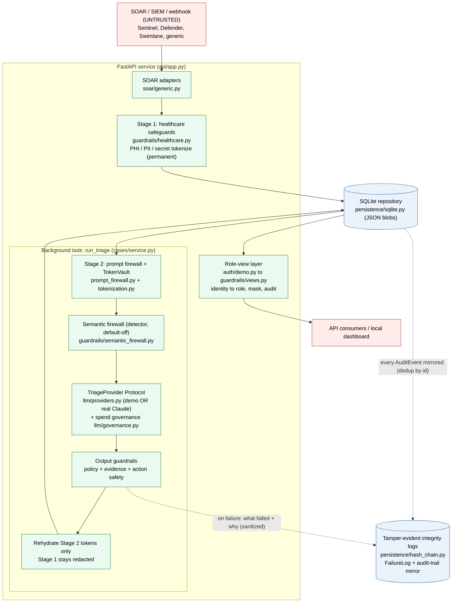

# Architecture

This document describes the system architecture, component relationships, data
flow, and key design decisions in ThreatPrism V2.

For directional constraints and future architecture targets, see
[ARCHITECTURAL_NORTH_STAR.md](ARCHITECTURAL_NORTH_STAR.md).

For locked decisions that are not open for re-debate, see
[DECISIONS.md](../DECISIONS.md).

---

## System Overview

ThreatPrism is a SOC triage automation backend. It accepts SOAR case payloads
from multiple security platforms, runs them through a multi-stage guardrail
pipeline, generates a structured triage report, and returns role-filtered views
of the results.

```
                  ┌─────────────────────────────────────────────────────────┐
                  │                     FastAPI Service                     │
                  │                                                         │
  SOAR payloads   │  ┌──────────┐   ┌──────────┐   ┌──────────────────┐    │
  ────────────────┤  │   SOAR   │──▶│Healthcare│──▶│   SQLite Repo    │    │
  (Sentinel,      │  │ Adapters │   │Safeguards│   │  (JSON blobs)    │    │
   Defender,      │  └──────────┘   └──────────┘   └────────┬─────────┘    │
   Swimlane,      │                                         │              │
   generic)       │                  Background Task        │              │
                  │  ┌──────────┐   ┌──────────┐   ┌───────▼──────────┐   │
                  │  │  Prompt  │──▶│   LLM    │──▶│   Guardrail      │   │
                  │  │ Firewall │   │ Provider │   │   Validation     │   │
                  │  │+ Stage 2 │   │(Protocol)│   │(policy+evidence  │   │
                  │  │Tokenize  │   └──────────┘   │ +action safety)  │   │
                  │  └──────────┘                   └───────┬──────────┘   │
                  │                                         │              │
                  │  ┌──────────────────────────────────────▼──────────┐   │
                  │  │              Role-View Layer                     │   │
  API consumers   │  │  auth/demo.py ──▶ guardrails/views.py           │   │
  ◀───────────────┤  │  (identity→role)   (masking per role)           │   │
                  │  └─────────────────────────────────────────────────┘   │
                  └─────────────────────────────────────────────────────────┘
```

### Diagram (rendered)



---

## Component Architecture

### Layer 1: Ingestion — SOAR adapters

**Module:** `soar/generic.py`

SOAR adapters normalize vendor-specific payloads into the internal `CaseCreate`
model. Each adapter is a subclass of `GenericSoarAdapter` with a `source_name`
and `accepted_sources` set. `normalize_soar_payload()` iterates the adapter
list and uses the first adapter that matches.

Current adapters:
- `GenericSoarAdapter` — default for untyped payloads
- `SentinelSoarAdapter` — Microsoft Sentinel incidents
- `DefenderXdrSoarAdapter` — Microsoft Defender XDR alerts
- `LogicAppsSoarAdapter` — Azure Logic Apps webhook payloads
- `SwimlaneMockSoarAdapter` — Swimlane SOAR cases

The adapter layer synthesizes default evidence and events when the inbound
payload doesn't include them, ensuring every case has at least one evidence
item (required for evidence-grounded triage).

### Layer 2: Data sanitization — Healthcare safeguards

**Module:** `guardrails/healthcare.py`

Runs at case intake, before anything is persisted. Scans the entire case
payload for sensitive data patterns:

- **Secrets** — API keys (OpenAI, Slack, GCP patterns), passwords
- **PHI** — MRN, patient ID, encounter ID, member ID, claim ID, appointment ID,
  DOB, clinical file paths
- **Context-sensitive identifiers** — emails, IPs, URLs that become PHI-risk
  when healthcare terms (patient, mrn, clinical, etc.) appear in the payload
- **PII** — SSN, phone numbers, street addresses

Detected values are replaced with typed tokens
(`[POTENTIAL_PHI:SSN:phi_0001]`) and recorded as `SanitizationRecord` entries
with `rehydration_allowed=False`. These tokens are permanent.

Key design decision: context-aware rules (`requires_context=True`) only fire
when the `_value_has_health_context()` scan finds healthcare terms anywhere in
the payload. This prevents over-tokenizing ordinary security telemetry in
non-healthcare cases.

### Layer 3: Persistence — SQLite repository

**Module:** `persistence/sqlite.py`

The repository uses a JSON-blob-in-SQLite pattern. Each table has:
- Primary key columns and a few denormalized index columns (source, status,
  timestamps)
- A `payload_json` column containing the full Pydantic model serialized as JSON

The JSON blob is the source of truth. The SQL columns exist for basic querying
and ordering. To read a record, the repository deserializes the JSON blob
back into the Pydantic model.

Tables:
- `cases` — `CaseRecord` (the central domain entity)
- `triage_reports` — `TriageReport` (one per case, after triage completes)
- `analyst_feedback` — `AnalystFeedback` (multiple per case)
- `disagreement_records` — `DisagreementRecord` (one per feedback submission)

In-memory mode (`sqlite:///:memory:`) holds a single persistent connection on
the repository instance. File-backed mode creates a new connection per
operation.

Design implication: Pydantic model schema changes must be
backwards-compatible with existing stored blobs, or a migration is needed.

### Layer 4: Triage preparation — Prompt firewall and tokenization

**Modules:** `guardrails/prompt_firewall.py`, `guardrails/tokenization.py`

Runs during `CaseService._prepare_case_for_model()`, after the case is
persisted but before the LLM sees it.

**Prompt firewall:** regex rules that detect prompt injection patterns
(instruction overrides, role overrides, system prompt requests, tool
execution requests, prompt exfiltration attempts). Matched text is replaced
with `[REDACTED_PROMPT_INJECTION]`. If any quarantine-level pattern matches,
a flag is set that can block triage.

**Stage 2 tokenization:** replaces security telemetry (IPs, URLs, emails, file
hashes, secret-like strings) with `TokenVault` tokens (`tp_ip_001`,
`tp_url_002`, etc.). The `TokenVault` is an in-memory dataclass that tracks
the raw-to-token mapping for later rehydration.

The `REHYDRATABLE_TYPES` set controls which token types can be restored after
the report passes guardrail checks. `secret_like` tokens are never
rehydratable.

### Layer 5: Triage — LLM provider

**Module:** `llm/providers.py`

The `TriageProvider` protocol defines one method: `generate_report(case) →
TriageReport`. Only `DeterministicDemoProvider` is implemented.

The demo provider uses keyword matching on the combined case text to assign
severity:
- critical/exfil/malware/ransomware → `Severity.critical`
- suspicious/credential/powershell → `Severity.high`
- alert/automation/closed → `Severity.medium`
- everything else → `Severity.low`

It also calls `map_mitre()` and `map_grc_controls()` to add MITRE ATT&CK
technique mappings and HITRUST-aligned GRC control mappings based on
evidence text keywords.

All reports set `analyst_review_required=True`. Reports include a `limitations`
list that explicitly states what ThreatPrism did not access.

### Layer 6: Output validation — Guardrail pipeline

**Modules:** `guardrails/policy.py`, `guardrails/evidence.py`,
`actions/safety.py`

Three independent checks run on the LLM output before it is accepted:

1. **Output policy scan** — `PROHIBITED_PATTERNS` regex list checked against
   the JSON-serialized report. Blocks: action execution claims, certainty
   claims, leaked secrets, compliance/certification language, clinical
   recommendations.

2. **Evidence validation** — every `evidence_id` cited in findings, MITRE
   mappings, GRC controls, and hypotheses must exist in the case's evidence
   set.

3. **Action safety** — blocks any report containing
   `"real_action_executed": true` in its JSON representation.

If any check returns issues, the case status becomes `blocked_by_guardrail`
and the report is not saved.

### Layer 7: Rehydration

After the report passes all guardrail checks, `CaseService._rehydrate_report()`
walks the report structure and replaces Stage 2 tokens with their original
values via `TokenVault.display_value()`. Stage 1 typed tokens (PHI/PII/secret)
are left untouched because they do not exist in the `TokenVault` — they were
tokenized by the healthcare safeguard layer with a separate
`HealthcareTokenVault` that is not carried through to rehydration.

### Layer 8: Authorization and role views

**Modules:** `auth/demo.py`, `guardrails/views.py`

**Authorization:** `authorize_role_view()` resolves the caller's identity and
effective role from their credential, then checks whether the requested view
role is permitted under `ROLE_VIEW_POLICY`. Both allows and denials generate
`AuditEvent` records.

**Role-view masking:** `render_role_view()` recursively walks any Pydantic
model or dict structure and applies text masking:
- `analyst` and `engineer` roles see raw security telemetry
- All other roles get IPs, URLs, emails, and hashes replaced with
  `[SECURITY_TELEMETRY:TYPE:masked]`
- Stage 1 typed tokens are visible to all roles but are never reversed

### Layer 9: Production identity readiness and verifier design

**Modules/docs:** `auth/production.py`,
`docs/PRODUCTION_TOKEN_VERIFIER_DESIGN.md`

`API_AUTH_MODE=external_oidc` is currently a static readiness and fail-closed
boundary. It validates OIDC-shaped settings but does not parse JWTs, fetch
JWKS keys, call a live IdP, or authorize production users.

The future token verifier design requires:

- bearer-token extraction,
- asymmetric signature validation,
- issuer, audience, expiration, not-before, and issued-at checks,
- required subject, tenant, and role claims,
- deterministic external-claim-to-ThreatPrism-role mapping,
- existing role-view policy enforcement,
- sanitized audit events, and
- no-network standard validation with fake local keys and fake JWKS fixtures.

Until that implementation lands, protected routes under `external_oidc` remain
closed.

---

## Data Model

### Central entities

```
CaseRecord (cases/schemas.py)
├── source, source_case_id, title, description
├── organization_context
├── alerts: list[Alert]
├── events: list[Event]           ← each has provenance
├── entities: list[Entity]
├── iocs: list[IOC]
├── evidence: list[Evidence]      ← each has evidence_id
├── status: CaseStatus
├── triage_status: TriageStatus
├── triage_report: TriageReport | None
├── analyst_feedback: list[AnalystFeedback]
├── audit_trail: list[AuditEvent]
├── sanitization_records: list[SanitizationRecord]
├── timeline, hypotheses, mitre_mappings, recommended_actions
├── simulated_actions, grc_controls
└── created_at, updated_at
```

```
TriageReport (cases/schemas.py)
├── determination: Determination   (benign|suspicious|malicious|critical)
├── severity: Severity             (low|medium|high|critical)
├── disposition: Disposition       (close|monitor|escalate|needs_more_info)
├── confidence: float [0.0, 1.0]
├── findings: list[Finding]        ← each cites evidence_ids
├── timeline: list[TimelineEvent]
├── mitre_mappings: list[MitreMapping]
├── hypotheses: list[Hypothesis]
├── recommended_actions: list[RecommendedAction]
├── simulated_actions: list[SimulatedAction]
├── grc_controls: list[GrcControl]
├── limitations: list[str]
├── analyst_review_required: bool  (always True)
└── rendered_report: str | None
```

### Identity model

Identifiers use a `{prefix}_{uuid4hex}` format generated by `ids.new_id()`:
- `case_` — case records
- `report_` — triage reports
- `feedback_` — analyst feedback
- `audit_` — audit events
- `ev-` — evidence items
- `evt-` — events
- `ioc-` — indicators of compromise
- `finding_` — findings
- `sanitize_` — sanitization records
- `triage_` — triage tracking IDs
- `alert_` — alerts
- `eval_` — eval run IDs

### State machine

Cases progress through these statuses:

```
received → normalized → queued_for_triage → triage_running
    → triage_completed (success path)
    → needs_analyst_review (guardrail blocked)
    → analyst_feedback_submitted (after feedback)
    → closed | failed
```

Triage status tracks the triage subprocess:

```
queued → running → completed | failed | blocked_by_guardrail | needs_review
```

---

## Analyst Feedback and Disagreement Tracking

When an analyst submits feedback via `POST /cases/{case_id}/analyst-feedback`,
`CaseService` compares the analyst's assessment against the triage report:

- `determination_mismatch` — analyst and ThreatPrism disagree on
  benign/suspicious/malicious/critical
- `severity_mismatch` — analyst and ThreatPrism disagree on severity level
- `disposition_mismatch` — analyst and ThreatPrism disagree on
  close/monitor/escalate
- `confidence_delta` — absolute difference between confidence scores

Manager review is required if any mismatch occurs, or if the analyst flags
`false_negative`, `missed_escalation`, or explicitly requests
`manager_review_required`.

Disagreement records are persisted and aggregated in operational metrics to
surface patterns in AI-vs-analyst agreement over time.

---

## Operational Read Models and Queues

`CaseService.get_operational_metrics()` computes aggregated metrics across all
cases including case counts by source/status, triage status distribution,
report decision breakdowns, guardrail activity, disagreement rates, timing
averages, and GRC mapping coverage.

`CaseService.list_case_read_models()` provides a filterable case list with
triage summaries and operational flags. Filters include source, status,
triage_status, severity, determination, and boolean flags for
manager_review_required, healthcare_review_required, guardrail_blocked, and
authorization_denied.

Dedicated review queue endpoints (`/queues/manager-review`,
`/queues/healthcare-review`) use the same read model infrastructure with
pre-applied filters.

All operational endpoints support role-view masking via the `?role=` parameter,
subject to authorization.

---

## CSI/RGOI Read-Only Cognition

**Modules:** `csi/schemas.py`, `csi/governance.py`, `csi/service.py`

CSI/RGOI adds a governed cognition layer without adding unrestricted AI memory.
The current implementation is read-only and uses fake demo cognitive objects
seeded in memory.

The cognitive architecture has four tiers:

- Immutable evidence.
- Structured intelligence.
- Approved knowledge.
- Ephemeral cognitive workspace.

Retrieval is governed by:

- tenant namespace filtering,
- role and purpose policy,
- retrieval zone policy,
- evidence citation validation,
- prompt-injection and healthcare safeguard checks,
- deterministic trust scoring,
- stale cognition handling,
- quarantine exclusion.

The API routes are:

- `GET /csi/objects`
- `GET /csi/objects/{object_id}`
- `GET /csi/lineage/{object_id}`
- `GET /csi/replay/{object_id}`
- `GET /csi/observability`
- `GET /csi/divergence`

These routes do not mutate knowledge, trust, suppressions, evidence, or case
state. AI-authored cognition is marked non-authoritative unless a future human
approval workflow approves it.

---

## Eval Harness

**Modules:** `evals/runner.py`, `evals/schemas.py`, `evals/cli.py`

The eval harness is a local regression defense system. It reads JSONL fixtures
from `tests/evals/`, evaluates each fixture against the appropriate guardrail
or security boundary, and writes sanitized result artifacts to `.eval_runs/`.

Each fixture specifies a `category` (one of 16 `EvalCategory` values) and a
`payload`. The runner dispatches to category-specific evaluation logic in
`_evaluate_by_category()`.

Key design decisions:
- **Path sandboxing:** fixture and output paths are validated by
  `_resolve_under_approved_dir()` to prevent directory traversal.
- **Sanitized previews:** eval result artifacts use `_safe_preview()` which
  runs the payload through prompt firewall → healthcare safeguard →
  role-view masking before writing, ensuring no raw sensitive values appear in
  artifacts.
- **No live LLM:** the eval harness uses the same deterministic demo provider
  and in-memory SQLite as the test suite.

---

## Design Decisions and Rationale

| Decision | Rationale |
|----------|-----------|
| JSON-blob persistence | Keeps the schema flexible during rapid iteration; Pydantic models are the authoritative structure; SQL columns are indexes only |
| Two-stage tokenization | Stage 1 (healthcare) protects regulated data permanently; Stage 2 (telemetry) allows controlled rehydration for analyst utility |
| Deterministic demo provider | Enables testing, demos, and evals without LLM API costs or nondeterminism |
| In-process background tasks | Sufficient for demo; avoids queue infrastructure until API and guardrails are stable |
| Provider-agnostic adapters | Prevents vendor lock-in; Microsoft integrations are first-class but not hardwired |
| Role-view masking at read time | Database stores full records; access control can evolve without data migration |
| Evidence-grounded reports | Every finding and mapping must cite evidence that exists in the case; prevents hallucinated citations |
| `ALLOW_REAL_ACTIONS=false` | Hard safety boundary for V2; real remediation is a future-version concern |
| Production token verifier design before runtime auth | Prevents unverified claims, live JWKS fetch, or provider-specific assumptions from becoming production authorization by accident |

---

## Future Architecture Targets

These are directional — they are not committed work:

- **Live production auth:** implement the approved token verifier design before
  OAuth/OIDC/Entra ID token verification replaces demo API-key auth
- **PostgreSQL:** replacing SQLite for multi-user, concurrent-write scenarios
- **Async worker:** Celery or equivalent replacing in-process background tasks
- **Real LLM provider:** implementing `TriageProvider` with OpenAI or local LLM
- **Threat intelligence:** activating VirusTotal, AbuseIPDB, URLScan stubs
- **External research provider adapter:** optional public-source discovery
  through a provider such as Exa.ai, disabled by default and non-authoritative
  until human review
- **Frontend dashboard:** consuming the read-model and metrics endpoints
- **CI/CD pipeline:** automated testing, linting, and security gates

See `docs/ARCHITECTURAL_NORTH_STAR.md` and
`docs/FUTURE_ENHANCEMENTS.md` for the decision rubric and sequencing guidance.
