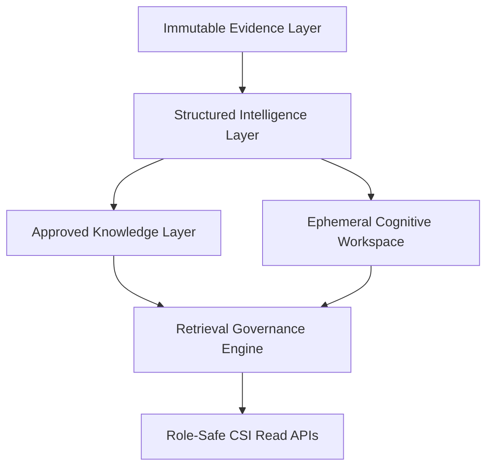
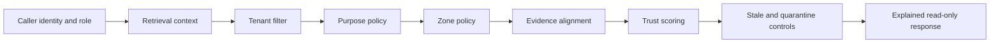

# Cognitive Security Infrastructure And RGOI

## Purpose

Cognitive Security Infrastructure (CSI) with Retrieval-Governed
Organizational Intelligence (RGOI) adds governed organizational cognition to
ThreatPrism without creating unrestricted AI memory.

CSI/RGOI is read-only in this slice. It lets ThreatPrism retrieve, correlate,
summarize, explain, and propose using governed cognitive objects. It does not
let AI mutate knowledge, publish suppressions, execute remediation, modify
trust, or become the source of truth.

## Four-Tier Architecture

| Tier | Purpose | Authority |
|---|---|---|
| Immutable Evidence Layer | Append-only evidence references and provenance anchors | System-observed, evidence only |
| Structured Intelligence Layer | Evidence-linked summaries, drift markers, divergence telemetry | Non-authoritative until reviewed |
| Approved Knowledge Layer | Human-approved organizational learning and manager summaries | Human-owned truth |
| Ephemeral Cognitive Workspace | AI proposals, competing interpretations, replay scaffolds | Non-authoritative |

## Implemented Components

| Component | File |
|---|---|
| Cognitive object model and response schemas | `src/threatprism/csi/schemas.py` |
| Evidence alignment validator | `src/threatprism/csi/governance.py` |
| Retrieval governance engine | `src/threatprism/csi/governance.py` |
| Trust scoring engine | `src/threatprism/csi/governance.py` |
| Drift and authority helpers | `src/threatprism/csi/governance.py` |
| Read-only retrieval service and demo fixture seed | `src/threatprism/csi/service.py` |
| FastAPI read routes | `src/threatprism/api/app.py` |
| Tests | `tests/test_csi_rgoi.py` |
| Tiny fake fixture description | `examples/csi/rgoi_cognitive_objects.json` |

## Retrieval-Governed Flow

Controls active in v0.1:

- read-only cognition
- tenant ID filtering
- role/purpose policy
- retrieval zone policy
- quarantine exclusion
- evidence citation enforcement
- trust thresholding
- prompt-injection sanitization
- healthcare safeguard scanning
- unsupported claim rejection

## API Surface

CSI/RGOI exposes read-only routes:

- `GET /csi/objects`
- `GET /csi/objects/{object_id}`
- `GET /csi/lineage/{object_id}`
- `GET /csi/replay/{object_id}`
- `GET /csi/observability`
- `GET /csi/divergence`

All routes require a `tenant_id` query parameter. Demo-key auth uses the same
identity-to-role and role-view authorization model as the existing case read
routes. When local auth is explicitly disabled for tests or local demo use,
CSI defaults to an analyst view.

## Security Boundary

CSI/RGOI does not add write APIs. It does not persist new memory, mutate trust,
change lifecycle state, approve knowledge, or alter evidence. It seeds fake
demo cognitive objects in memory so the governance path can be tested without
live providers or real data.

Optional external research providers, such as Exa.ai, are not part of CSI/RGOI
v0.1. They are deferred future enhancement candidates only. If added later,
they must feed non-authoritative `external_unreviewed` candidates through a
disabled-by-default adapter with provenance capture, human review, no standard
validation network calls, and no automatic memory write-back, trust mutation,
or source-of-truth changes.

Tenant isolation is implemented as a defensive cognition namespace. It is not
MSSP multi-tenancy, shared production tenancy, or a production tenant
administration model.

## Human Truth Ownership

AI-authored objects can be retrieved only as non-authoritative cognition unless
a future human governance path approves them. Competing interpretations are
preserved rather than overwritten. Divergence telemetry explicitly records
AI-vs-human disagreement while keeping human-approved interpretation as the
truth owner.
